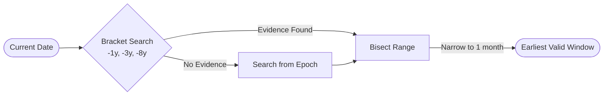
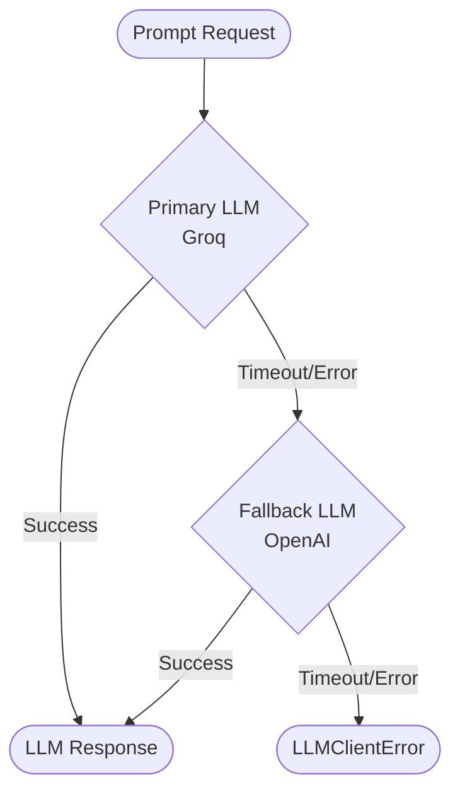

# Patient Zero - Core

**Claim provenance and propagation forensics engine, powered by SerpApi.**

Patient Zero is a robust, modular system designed to dissect raw text inputs (such as news articles, internet forwards, or headlines), extract factual assertions, trace their origins across the internet using temporal search bisection, and classify the stances of various search results. It aims to understand how a claim propagated and whether it is supported or refuted by independent sources.

---

## 🧩 System Architecture

The core engine orchestrates a multi-stage pipeline (`src/patientzero/pipeline.py`), invoking specialized modules to process text while maintaining strict adherence to performance and API credit budgets.

```mermaid
flowchart TD
    Input([Raw Text Input]) --> Atomizer

    subgraph "1. Atomization"
    Atomizer(Atomizer) --> Claims([List of Claims])
    end

    Claims --> Pipeline Orchestration

    subgraph "2. Pipeline Orchestration (Per Claim)"
        Pipeline Orchestration --> Bisection(Temporal Bisection)
        Pipeline Orchestration --> Serp(SerpApi Query per Locale)
        
        Serp --> Results([Search Results])
        
        Results --> Stance(Stance Classification)
        Results --> Independence(Independence Scoring)
    end

    Bisection --> Origin([Origin Date / URLs])
    Stance --> Stances([Support / Refute Labels])
    Independence --> Score([Independence Score])

    Origin --> Aggregation(Report Generation)
    Stances --> Aggregation
    Score --> Aggregation

    Aggregation --> Output([List of ClaimReports])
```

### Core Components

#### 1. Atomizer (`atomizer.py`)
Splits raw user input into individually checkable factual assertions. It uses an LLM to extract these claims.
*   **Behavior**: If the input contains no verifiable claims (e.g., pure opinion), it gracefully returns an empty list, allowing the pipeline to exit early without error.

#### 2. Temporal Bisection (`bisection.py`)
Finds the earliest indexed-date window in which a claim's corroborated evidence first appears. This is a critical feature for tracing the "patient zero" of a viral claim.
*   **Bracket Probes**: Initiates exponential bracket probes (1 year, 3 years, and 8 years ago) to find a window with corroborated evidence.
*   **Convergence**: Bisects the dates repeatedly until the window narrows down to approximately 1 month (or reaches maximum tolerance).
*   **Validation**: Every probe strictly checks for **relevance** (deterministic token-overlap) and **corroboration** (at least 2 matching results). 



#### 3. Stance Classification (`stance.py`)
Performs batched LLM stance classification for the search results retrieved for a claim.
*   **Nuanced Labels**: Strictly avoids boolean `true`/`false` labels. Instead, it categorizes results as `support`, `refute`, `unrelated`, or `unclear`.
*   **Evidence Collection**: Extracts and provides a justifying quote directly from the search result's snippet.

#### 4. Independence Scoring (`independence.py`)
Groups search results into clusters to evaluate the independence of the sources. It ensures that a claim isn't just being superficially echoed by a single network or domain, providing an independence score that reflects genuine multi-source corroboration.

#### 5. SerpApi Gateway (`serp_client.py`)
The unified network access layer for all search queries.
*   **Caching (`cache.py`)**: Every network call is routed through a local cache to prevent redundant requests and conserve SerpApi credits.
*   **Mocking**: Provides a `SERPAPI_MOCK=1` mode to run entirely off local JSON fixtures during testing and development.

---

## 🤖 LLM Strategy & Resilience

To maintain high availability and manage costs, Patient Zero utilizes a primary-fallback LLM architecture (`llm_client.py`).



*   **Groq (Primary)**: Favored for speed and low cost on standard tasks.
*   **OpenAI (Fallback)**: Steps in automatically if the primary provider fails.
*   **Graceful Degradation**: If both providers fail (raising an `LLMClientError`), the pipeline catches the error and degrades the specific task to a partial result (e.g., marking stances as "unclear" or skipping a single claim) rather than crashing the entire batch process.

---

## 🛠 Tech Stack & Dependencies

- **Language**: Python `>= 3.10`
- **Core Dependencies**: `requests>=2.31`
- **Optional Dependencies**: 
    - `[llm]`: Installs `groq>=0.11` and `openai>=1.40` for LLM capabilities.
    - `[dev]`: Installs `pytest>=8.0` and `pytest-cov>=5.0` for development and testing.

---

## 🚀 Installation & Setup

1. **Clone the repository and install core:**
   ```bash
   pip install .
   ```

2. **Install with LLM Provider support:**
   ```bash
   pip install .[llm]
   ```

3. **Install for Development:**
   ```bash
   pip install .[dev]
   ```

---

## ▶️ Running the API + Web UI

```bash
python -m venv .venv && .venv/Scripts/activate    # Linux/macOS: source .venv/bin/activate
pip install -e ".[dev,llm,api]"
cp .env.example .env                                # then fill in SERPAPI_API_KEY, GROQ_API_KEY, OPENAI_API_KEY
uvicorn patientzero_api.main:app --port 8000

cd frontend && cp .env.example .env.local && npm install && npm run dev   # http://localhost:3000
```

`SERPAPI_MOCK=1` with `SERPAPI_MOCK_DIR` reads SerpApi responses from fixtures instead of the network (the LLM keys are still required).

---

## ⚙️ Configuration & Environment

The application relies on API keys injected into the core clients. Set these in your environment or pass them directly during client instantiation:

*   **SerpApi**: Requires a valid API key for `SerpClient`.
*   **LLMs**: Requires `GROQ_API_KEY` and `OPENAI_API_KEY` for the `FallbackLLMClient` to operate correctly.

---

## 🧪 Testing and Mocking

Patient Zero is designed with robust testing capabilities that do not require spending API credits.

Enable the SerpApi mock mode to use local JSON fixtures instead of making live network calls:

```bash
export SERPAPI_MOCK=1
python -m pytest tests/ -v
```

**Note:** The codebase mandates that tests never make actual network calls to LLM providers. `FakeLLMClient` is used extensively in unit tests to simulate predictable LLM outputs.

---

## 📜 Core Design Constraints (Spec)

Patient Zero adheres strictly to several core behavioral constraints:

1. **No Verdicts**: The engine will never output a definitive "True" or "False" verdict for a claim. It surfaces context, origins, and independent stances, leaving the final judgment to the human user.
2. **Graceful Degradation**: Failure in one component (like an LLM timeout while classifying stances for one claim) must not abort the pipeline. The system must degrade to partial results (e.g., returning the claims that *did* succeed, or returning "unclear" stances).
3. **Credit Discipline**: Bisection's relevance checks deliberately use deterministic token-overlap rather than LLM calls to prevent exponential LLM costs during rapid search iteration.
